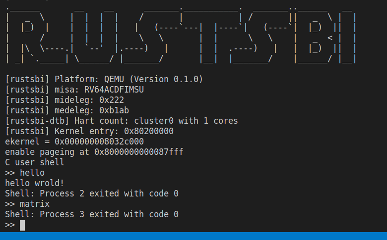

# 进程及进程管理

这一章中，我们将实现更加灵活的进程控制，具体来说，我们将实现如下四个系统调用：

* sys_read(int fd, char* buf, int size): 从标准输入读取若干个字节。
* sys_fork(): 创建一个与当前进程几乎完全一致的进程。
* sys_exec(char* filename): 修改当前进程，使其从头开始执行指定程序。
* sys_wait(int pid, int* exit_code): 等待某一个或者任意一个子进程结束，获取其 exit_code。

## usershell

在分析内核实现之前，我们先来看看完成这一章的内容之后，我们能干什么新奇的事情。最炫酷的是，我们可以运行 shell 了！

看看我们的 `loader.c` 里加载进程的逻辑有那些变化：

```c
// kernel/loader.c
int run_all_app() {
    struct proc *p = allocproc();
    p->parent = 0;
    int id = get_id_by_name("user_shell");
    if(id < 0)
        panic("no user shell");
    loader(id, p);
    p->state = RUNNABLE;
    return 0;
}
```

可以看到，虽然函数名称没有变，但是这个 `run_all_app` 函数和以往干的事情完全不一样！它仅仅加载了一个程序，那就是 `user_shell`，而 `user_shell` 运行之后会这样：



shell 就是一个极度简化的标准 console，它会死循环的等待用户输入一个代表程序名称的字符串(通过`sys_read`)，当用户按下空格之后，shell 会使用 `fork` 和 `exec` 创建并执行这个程序，然后通过 `sys_wait` 来等待程序执行结束，并输出 `exit_code`。有了 shell 之后，我们可以只执行自己希望的程序，也可以执行某一个程序很多次来观察输出，这对于使用体验是极大的提升！可以说，第五章的所有努力都是为了支持 shell。

## fork

fork 是 unix 世界中创建新进程的标准方法，也是唯一的方法。fork 显然是实现 shell 的核心 syscall。

那么 fork 需要做那些事情呢？

首先，由于要创建一个新的进程，我们必须申请一个新的进程控制块。事实上，我们的最终目标也就是一个新的进程控制块。为了支持进程控制，进程控制块也进行了一些修改：

```diff
// kernel/proc.c
struct proc {
    enum procstate state;     
    int pid;                   
    pagetable_t pagetable;      
    uint64 ustack;
    uint64 kstack;       
    struct trapframe *trapframe; 
    struct context context;   
+   uint64 sz;                   // Memory size
+   struct proc *parent;         // Parent process
    uint64 exit_code;
};
```

申请新的进程控制块之后，我们还需要对其完成最基本的初始化。包括: `stata`、`pid`、`kstack`、`context` 几项（这几项的初始化和第三、四章加载新进程时一样）。

由于要和父进程一模一样，其他项就需要拷贝父进程的了，其中 `trapframe` 可以直接拷贝：

```c
*(child->trapframe) = *(parent->trapframe)
```

对页表的拷贝就比较复杂了，因为我们不能仅仅拷贝一份一模一样的页表，那么父子进程就会修改同样的物理内存，发生数据冲突，不符合进程隔离的要求。需要把页表对应的页先拷贝一份，然后建立一个对这些新页有同样映射的页表。这一工作由一个 `uvmcopy` 的函数去做。

```c
uvmcopy(p->pagetable, np->pagetable, p->sz);
```

还记得我们在第四章设定的用户内存模型吗？它非常的简单，仅仅是从 0x0 开始的一段连续内存，所以这里可以偷懒不去便利整个页表。直接拷贝 [0x0, memory size) 的内存，memory size 也就是 `proc->sz`，进程加载的时候会计算得到。

<font size=4 color=#D2691E>重要提醒!</font>
> 这种实现在目前的框架下不会导致问题，但是如果把 lab4 的 mmap 也考虑到的话，fork 就会错误。测例中严格避免了 mmap 和 fork 同时出现的情况。

最后，fork 要求子进程的返回值是 0，所以需要修改 `trapframe->a0`，同时需要设定父子关系。最终，fork 的实现长这个样子：

```c
// kernel/proc.c
int
fork(void)
{
    struct proc *np;
    struct proc *p = curr_proc();

    // Allocate process.
    if((np = allocproc()) == 0){
        panic("allocproc\n");
    }
    np->state = RUNNABLE;

    // copy saved user registers.
    *(np->trapframe) = *(p->trapframe);

    // Copy user memory from parent to child.
    if(uvmcopy(p->pagetable, np->pagetable, p->sz) < 0){
        panic("uvmcopy\n");
    }
    np->sz = p->sz;

    // Cause fork to return 0 in the child.
    np->trapframe->a0 = 0;

    np->parent = p;

    return np->pid;
}
```

`uvmcopy` 的实现见 `vm.c`，虽然是 fork 的核心实现，但并不复杂，不做赘述。

值得一提的是，在这种实现下，父进程会马上返回，而子进程会进入调度队列，等待调度到的时候执行。

## exec

exec 要执行一个新的进程，它要干的事情和 `bin_loader` 是很相似的。事实上，不同点在于，exec 需要先清理并回收掉当前进程占用的资源，目前只有内存。

内存的回收通过如下函数完成：

```c
void
proc_freepagetable(pagetable_t pagetable, uint64 sz)
{
    uvmunmap(pagetable, TRAMPOLINE, 1, 0); 
    uvmunmap(pagetable, TRAPFRAME, 1, 0);
    uvmfree(pagetable, sz);
}
```

需要注意的是，由于 `trapframe` 和 `trampoline` 是可以复用的（每个进程都一样），所以我们并不会把他们删掉，而仅仅是 unmap。而对于用户真正的数据，就会删掉映射的同时把物理页面也 free 掉。

> 其实 `trapframe` 和 `trampoline` 也可以不 unmap 直接用，但我们想复用 loader.c 中的代码，所以先 unmap 掉。

最后，我们的 exec 长这样：

```c
int exec(char* name) {
    struct proc *p = curr_proc();
    proc_freepagetable(p->pagetable, p->sz);
    p->sz = 0;

    int id = get_id_by_name(name);
    bin_loader(id, p);
    return 0;
}
```

`get_id_by_name` 仅仅完成了从程序名称到程序 id 的转化，十分简单。

看似 exec 非常简单，但其实 `bin_loader` 在第五章有比较大的调整。

```c
void bin_loader(uint64 start, uint64 end, struct proc *p) {
    uint64 s = PGROUNDDOWN(start), e = PGROUNDUP(end), length = e - s;
    // proc_pagetable 完成 trapframe 和　trampoline 的映射
    p->pagetable = proc_pagetable(p);   
    // 完成 .bin 数据的映射
    for(uint64 va = BASE_ADDRESS, pa = s; pa < e; va += PGSIZE, pa += PGSIZE) {
        void* page = kalloc();
        memmove(page, (const void*)pa, PGSIZE);
        mappages(p->pagetable, va, PGSIZE, (uint64)page, PTE_U | PTE_R | PTE_W | PTE_X);
    }
    // 完成用户栈的映射
    alloc_ustack(p);    

    p->trapframe->epc = BASE_ADDRESS;
    p->sz = USTACK_SIZE + length;
}
```

其中，对于用户栈、`trapframe`、`trampoline` 的映射没有变化，但是对 .bin 数据的映射似乎面目全非了，竟然由一个循环完成。

其实，这个循环的逻辑十分简单，就是对于 .bin 的每一页，都申请一个新页并进行内容拷贝，最后建立这一页的映射。之所以这么麻烦完全是由于我们的物理内存管理过于简陋，一次只能分配一个页，如果能够分配连续的物理页，那么这个循环可以被一个 `mappages` 替代。

那么另一个问题是，为什么要拷贝呢？想想 lab4 我们是怎么干的，直接把虚存和物理内存映射就好了，根本没有拷贝。那么，拷贝是为了什么呢？其实，按照 lab4 的做法，程序运行之后就会修改仅有一份的程序"原像"，你会发现，lab4 的程序都是一次性的，如果第二次执行，会发现 .data 和 .bss 段数据都被上一次执行改掉了，不是初始化的状态。但是 lab4 的时候，每个程序最多执行一次，所以这么做是可以的。但在 lab5 所有程序都可能被无数次的执行，我们就必须对“程序原像”做保护，在“原像”的拷贝上运行程序了。

## wait

在 fork 设  定好父子关系之后，wait 的实现就很简单了。你可能好奇为什么进程只有一个 parent 指针，没有 child 数组，这样的话进程要如何知道自己有那些子进程呢？当然维护一个子进程数组也是可以的。至于如何得到子进程，遍历进程数组就好了。

wait 的接口要求是：

waitpid
  * syscall ID：260
  * 功能：当前进程等待一个子进程结束，并获取其返回值。
  * C 接口：`int waitpid(int pid, int *status);`
  * 参数：
    * **pid** 表示要等待结束的子进程的进程 ID，如果为 0或者-1 的话表示等待任意一个子进程结束；
    * **status** 表示保存子进程返回值的地址，如果这个地址为 0 的话表示不必保存。
  * 返回值：如果出现了错误则返回 -1；否则返回结束的子进程的进程 ID。
  * 说明: 
    * 如果子进程存在且尚未完成，该系统调用阻塞等待。
  * 可能的错误：
    * pid 非法或者指定的不是该进程的子进程。
    * 传入的地址 status 不为 0 但是不合法；

> 顺带一提，C 版代码的实现是阻塞的，但是 Rust 版代码的系统调用是非阻塞的，如果子进程没有结束，不会阻塞等待而是马上返回。所以 rust 在用户态实现了阻塞等待，这不影响实验。

wait 的思路就是便利进程数组，看有没有和 pid 匹配的进程。如果有且已经结束，按要求返回。如果制定进程不存在或者不是当前进程子进程，返回错误。如果子进程存在但未结束，调用 `sched` 等待。

代码如下，实现简单，不做解释：

```c
int
wait(int pid, int* code)
{
    struct proc *np;
    int havekids;
    struct proc *p = curr_proc();

    for(;;){
        // Scan through table looking for exited children.
        havekids = 0;
        for(np = pool; np < &pool[NPROC]; np++){
            if(np->state != UNUSED && np->parent == p && (pid <= 0 || np->pid == pid)){
                havekids = 1;
                if(np->state == ZOMBIE){
                    // Found one.
                    np->state = UNUSED;
                    pid = np->pid;
                    *code = np->exit_code;
                    return pid;
                }
            }
        }
        if(!havekids){
            return -1;
        }
        p->state = RUNNABLE;
        sched();
    }
}
```

最后一提，和前几章不同的是，由于 ch5 的进程有不可复用的资源：代码副本，所以进程结束的时候要进行资源释放，靠如下函数实现：

```c
// kernel/proc.c
static void
freeproc(struct proc *p)
{
    if(p->trapframe)
        kfree((void*)p->trapframe);
    p->trapframe = 0;
    if(p->pagetable)
        proc_freepagetable(p->pagetable, p->sz);    // 解除映射并删除对应页面
    p->pagetable = 0;
    p->state = UNUSED;
}
```

该函数在进程的 `exit` 函数里调用。

<font size=4 color=#D2691E>重要提醒!</font>
> lab4 的 mmap 打破了连续内存的假定，所以会导致使用 mmap 后，ch5 程序 exit 会出错。对此框架的做法是: 放任内存泄露。(: 反正能 work 等下一轮迭代再修吧...)

## shell

从此我们就使用 shell 来运行其他程序了，从前面我们知道现在我们的 os 会默认加载 shell 这个用户程序，来看看 shell 的实现吧！

```c++
// 手搓了一个极简的 stack，用来维护用户输入，保存一行的输入
char line[100] = {};
int top = 0;
void push(char c) { line[top++] = c; }
void pop() { --top; }
int is_empty() { return top == 0; }
void clear() { top = 0; }

int main() {
    printf("C user shell\n");
    printf(">> ");
    // shell 是不会结束的
    while (1) {
        // 读取一个字符
        char c = getchar();
        switch (c) {
            // 敲了回车，将输入内容解析位一个程序名，通过 fork + exec 执行 
            case LF:
            case CR:
                printf("\n");
                if (!is_empty()) {
                    push('\0');
                    int pid = fork();
                    if (pid == 0) {
                        // child process
                        if (exec(line) < 0) {
                            printf("no such program\n");
                            exit(0);
                        }
                        panic("unreachable!");
                    } else {
                        // 父进程 wait 执行的函数
                        int xstate = 0;
                        int exit_pid = 0;
                        exit_pid = wait(pid, &xstate);
                        assert(pid == exit_pid, -1);
                        printf("Shell: Process %d exited with code %d\n", pid, xstate);
                    }
                    // 无论如何，清空输入 buffer
                    clear();
                }
                printf(">> ");
                break;
            case BS:
            case DL:
                // 退格键
                if (!is_empty()) {
                    putchar(BS);
                    printf(" ");
                    putchar(BS);
                    pop();
                }
                break;
            default:
                // 普通输入，回显
                putchar(c);
                push(c);
                break;
        }
    }
    return 0;
}
```

其实就是一个十分简单粗暴的字符串处理....，但是它确实能用，而且比我们以往运行程序的方式要好用很多！

## 展望

lab5 使得我们可以运行好多好多的进程，使用 fork 可以指数级别的制造新进程，但是这些进程之间如果不能很好的配合，仍然会比较僵硬，所以 ch6 我们将实现进程间通信 pipe.